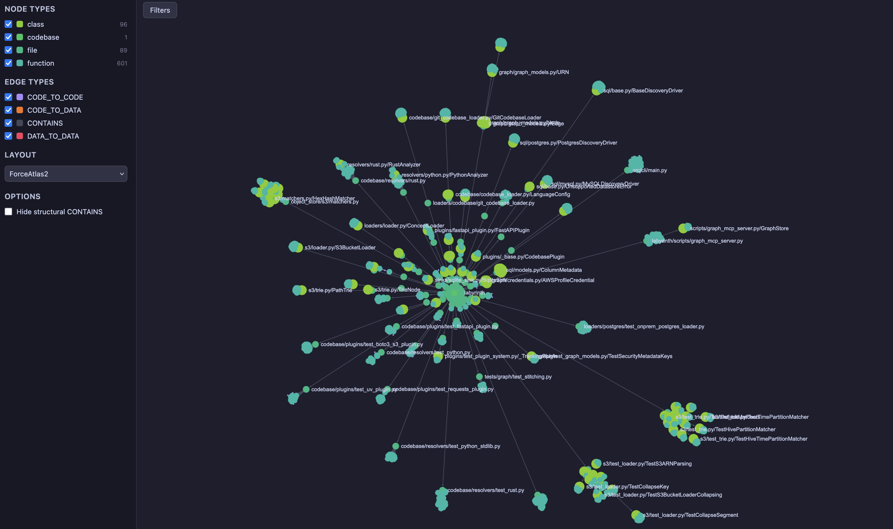
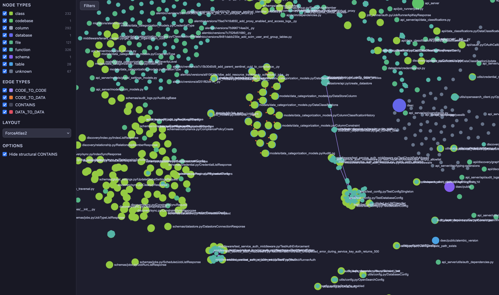

# Labyrinth


Labyrinth is an AI knowledge base that discovers code, databases, and cloud resources and stitches them into a queryable graph for your AI agent.



## Install

Requires Python 3.13+.

```bash
uv tool install labyrinth-kb
```

Or install from source:

```bash
git clone https://github.com/usemantle/labyrinth.git && cd labyrinth
uv sync
uv pip install -e .
```

## Getting Started

### 1. Create a project

```bash
labyrinth init my-project
```

This creates `~/.labyrinth/` and initializes a project directory under `~/.labyrinth/projects/my-project/`. The project is automatically set as the active project.

### 2. Add targets

Register targets for your project:

```bash
labyrinth add-target
```

An interactive fuzzy selector presents the available target types:

| Target | Description | URN components | Credentials |
|--------|-------------|---------------|-------------|
| **PostgreSQL** | Connects to a Postgres database and discovers schemas, tables, and columns | host, port, database | username / password |
| **AWS Account** | Discovers resources across an entire AWS account via plugins (see below) | account ID, region | AWS profile |
| **Local Codebase** | Walks a local directory and analyzes source code | path to directory | none |
| **GitHub Repository** | Clones and analyzes a GitHub repo | org, repo | none |

### 3. AWS Account plugins

The **AWS Account** target discovers resources via plugins. After adding an AWS Account target, enable plugins with:

```bash
labyrinth add-plugin
```

Available plugins:

| Plugin | What it discovers |
|--------|-------------------|
| **apigateway** | API Gateway HTTP APIs, stages, routes, and integrations |
| **ecr** | ECR repositories, tagged images, and OCI labels |
| **ecs** | ECS clusters, services, and task definitions |
| **elbv2** | Application and Network Load Balancers, listeners, and target groups |
| **iam** | IAM roles, users, and policies |
| **rds** | RDS database instances |
| **route53** | Route53 hosted zones and DNS records |
| **s3** | S3 buckets with collapsed object path hierarchies |
| **sso** | AWS SSO permission sets and assignments |
| **vpc** | VPCs, subnets, security groups, and NAT gateways |

### 4. Codebase plugins

Codebase targets support plugins that enrich the graph with framework-specific metadata:

```bash
labyrinth add-plugin
```

Select a codebase target, then pick a plugin:

| Plugin | What it detects |
|--------|----------------|
| **sqlalchemy** | ORM model classes with `__tablename__`, tags nodes with the mapped table name |
| **fastapi** | Route decorators (`@router.get`, etc.), resolves full route paths including `APIRouter` and `include_router` prefixes |
| **boto3-s3** | S3 client creation and API calls (`put_object`, `get_object`, etc.), tags with operation types |

Plugins run automatically during scan. You can add multiple plugins to the same target.

### 5. Scan

Build the knowledge graph from all registered targets:

```bash
labyrinth scan
```

The scan:
1. Connects to each data source and extracts nodes (databases, tables, columns, files, classes, functions, cloud resources, etc.)
2. Runs language-specific analysis (Python import/call resolution)
3. Runs plugins for framework-specific enrichment
4. Stitches cross-domain edges (e.g. `CODE_TO_DATA` linking ORM models to database tables, networking edges linking DNS to load balancers to ECS services)
5. Writes the result to `~/.labyrinth/projects/<project>/graph.json`

### 6. Serve

Launch the Labyrinth dashboard in the browser:

```bash
labyrinth serve
```

This starts a local server (default port 8787) and opens the dashboard with:
- Interactive graph visualization
- Node filtering by type (database, table, file, class, function, bucket, image repository, etc.)
- Edge filtering by relationship (CONTAINS, CODE_TO_DATA, CODE_TO_CODE, etc.)
- ForceAtlas2, circular, and random layouts
- Hover tooltips showing node metadata
- Agent analysis results and heuristic findings

Use `--port` to change the default port:

```bash
labyrinth serve --port 9876
```



### 7. Agent: analyze and investigate

Labyrinth includes an autonomous agent that identifies security concerns in your knowledge graph using **heuristics**.

#### What is a heuristic?

A heuristic is a pattern detector that scans your knowledge graph for nodes matching suspicious criteria. Each heuristic targets a specific node type and metadata key, and emits **candidates** — graph nodes that warrant further investigation.

Available heuristics:

| Heuristic | What it detects |
|-----------|----------------|
| **unlinked_dockerfile** | Dockerfiles without a `builds` edge to an ECR repository |
| **unlinked_s3_code** | Functions with S3 operations but no `reads`/`writes` edge to a bucket |
| **orphaned_ecr_repo** | ECR image repositories with no incoming `builds` edge |
| **insecure_endpoint** | HTTP endpoints without an authentication scheme |
| **vulnerable_dependency** | Dependencies with known CVEs |
| **unlinked_entrypoint** | Dockerfiles with ENTRYPOINT/CMD but no `executes` edge |

#### Analyze

Run all heuristics against the current graph:

```bash
labyrinth agent analyze
```

This scans the graph, identifies candidates, and saves the results to `~/.labyrinth/projects/<project>/heuristics.json`. The output shows a summary of findings:

```
Analysis complete: 5 candidate(s)

  insecure_endpoint: 2
  orphaned_ecr_repo: 1
  unlinked_dockerfile: 2

Candidates:
  2970d36f4e31  [insecure_endpoint] urn:_:repo:_:_:...
  ...
```

You can view the analyzed heuristic targets in the dashboard by running `labyrinth serve` after analysis.

#### Run

Investigate a specific candidate by its UUID:

```bash
labyrinth agent run <candidate_id>
```

The agent uses Claude to autonomously investigate the candidate — reading source code, querying the knowledge graph via MCP, and determining whether the finding is valid. Results are saved to `~/.labyrinth/projects/<project>/reports.json`.

### 8. MCP Server

Give your AI agent direct access to the knowledge graph:

```bash
claude mcp add <mcp-server-name> labyrinth mcp
```

### Managing your project

```bash
labyrinth describe       # Print the active project's configuration
labyrinth set-active     # Switch the active project
labyrinth remove-target  # Interactively remove a target
labyrinth config         # View and modify global settings
```

## Running the Example App

The `examples/` directory contains a testapp and Terraform configuration that deploys a full AWS environment for testing Labyrinth.

### Prerequisites

- Docker
- AWS CLI configured with an SSO or IAM profile
- Terraform

### 1. Deploy the infrastructure

```bash
cd examples/terraform
terraform init
terraform apply
```

This creates a VPC, ECS cluster, RDS PostgreSQL instance, ECR repository, ALB, API Gateway, Route53 zone, and S3 bucket.

### 2. Build and push the test app

```bash
cd examples/testapp
docker build . -t testapp
```

Tag and push to ECR (replace `<account_id>` and `<region>` with your values):

```bash
# Authenticate Docker with ECR
aws ecr get-login-password --region <region> --profile <profile> \
  | docker login --username AWS --password-stdin <account_id>.dkr.ecr.<region>.amazonaws.com

# Tag and push
docker image tag testapp:latest <account_id>.dkr.ecr.<region>.amazonaws.com/labyrinth-test-app
docker image push <account_id>.dkr.ecr.<region>.amazonaws.com/labyrinth-test-app:latest
```

### 3. Set up a Labyrinth project

```bash
labyrinth init my-test-env

# Add the testapp codebase
labyrinth add-target    # select "Local Codebase", point to examples/testapp

# Add the AWS account
labyrinth add-target    # select "AWS Account", enter account ID and region

# Enable AWS plugins
labyrinth add-plugin    # select the AWS Account target, enable ecr, ecs, s3, etc.

# Add codebase plugins
labyrinth add-plugin    # select the codebase target, enable fastapi
```

### 4. Scan, analyze, investigate

```bash
labyrinth scan
labyrinth serve              # view the graph
labyrinth agent analyze      # find security candidates
labyrinth serve              # view candidates in the dashboard
labyrinth agent run <id>     # investigate a specific candidate
```

## Zsh Completions

Eval in your `.zshrc` (simplest):

```bash
eval "$(_LABYRINTH_COMPLETE=zsh_source labyrinth)"
```
